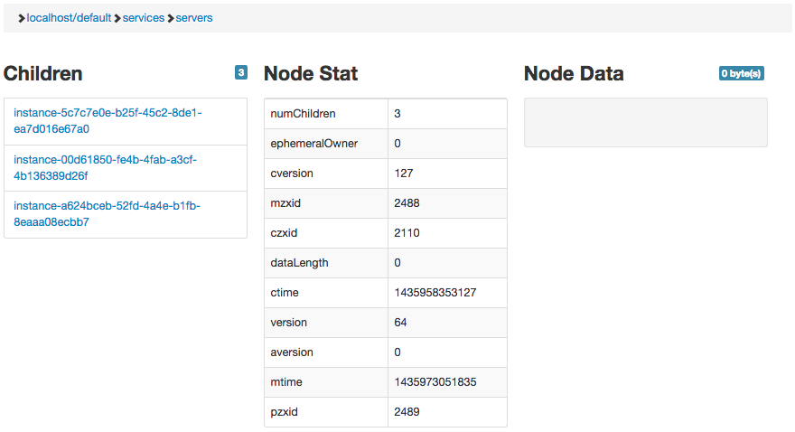

### Client/ Server Example

In this example, there are 3 servers, and 1 client. Each server will listen handle one request and then remove itself from the service directory after it accepts a connection. Once the request is processed, the server will shutdown.

#### Running

You can run the example by installing foreman `gem intall foreman` and running `foreman start` in this directory.

#### Screenshot

Here's a screenshot of zookeeper when the servers are started.



#### Output

```
19:16:03 server1.1 | started with pid 82212
19:16:03 server2.1 | started with pid 82213
19:16:03 server3.1 | started with pid 82214
19:16:03 client.1  | started with pid 82215
19:16:05 server2.1 | Starting server 2...
19:16:05 server2.1 | Server 2 listening on port 4305.
19:16:05 server2.1 | Server completed its work!
19:16:05 server3.1 | Starting server 3...
19:16:05 server3.1 | Server 3 listening on port 4768.
19:16:05 server3.1 | Server completed its work!
19:16:05 server2.1 | exited with code 0
19:16:05 system    | sending SIGTERM to all processes
19:16:05 server3.1 | exited with code 0
19:16:05 client.1  | Client are starting.
19:16:05 server1.1 | Starting server 1...
19:16:05 client.1  | Client request 1 is starting at port 4305.
19:16:05 server1.1 | Server 1 listening on port 4732.
19:16:05 client.1  | Reply 'I'm sending 1' from server 4305
19:16:05 server1.1 | Server completed its work!
19:16:05 client.1  | Client request 2 is starting at port 4768.
19:16:05 client.1  | Reply 'I'm sending 2' from server 4768
19:16:05 client.1  | Client request 3 is starting at port 4732.
19:16:05 client.1  | Reply 'I'm sending 3' from server 4732
19:16:05 client.1  | All client request finished!
19:16:05 server1.1 | exited with code 0
19:16:05 client.1  | exited with code 0
```
